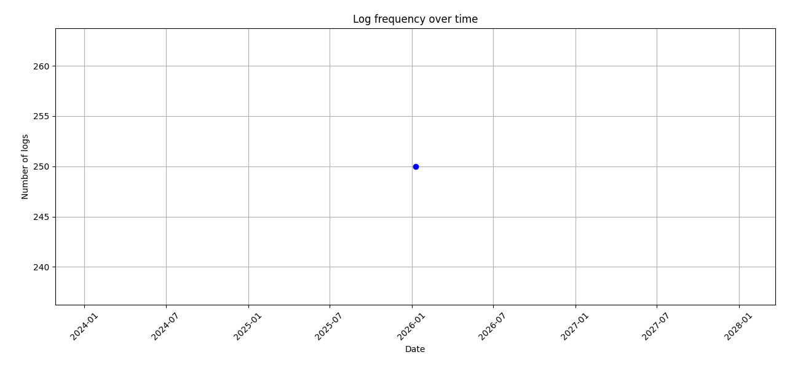

# LogGen

## Project Overview 
LogGen demonstrates a complete **end-to-end mini pipeline** for generating, processing, analyzing, and visualizing synthetic application/server logs — a very common task in software development, DevOps, cybersecurity monitoring, and data engineering.

The project consists of **three independent but conceptually related Python scripts**, each highlighting different aspects of log handling and data processing 

### 1. Alternative Log Generator  
**File: `Log_generator.py`**

This script is designed to quickly generate synthetic application/server log entries and save them to a text file. It focuses purely on log creation with minimal dependencies and basic error handling.

- Uses UTC time (not local time)
- Longer user IDs compared to many simple generators (8 chars)
- Very lightweight — only 4 imported modules
- Includes basic error logging to a separate file

**Educational value:**
- Quick generation of test log files
- Creating sample data for other tools/scripts
- Learning basic random data generation in Python
- Situations where you want UTC-based timestamps
- Minimal-dependency log simulation

### 2. Educational Web Scraping Example  
**File: `Web_scrapper.py`**

This script demonstrates a basic but robust web scraping workflow: fetching a webpage → parsing HTML → filtering content → saving structured results.
It targets the official Python 3 documentation homepage as an example.

- `requests` → fetching webpage
- `BeautifulSoup` → HTML parsing
- `re` (regular expressions) → pattern matching
- Retry mechanism with exponential backoff
- Saving results in clean JSON format

**Educational value:**
- Demonstrates robust fetching (retries)
- Clean HTML parsing with BeautifulSoup
- Content filtering using regular expressions
- Structured data storage using JSON
- Proper error messaging

### 3. Log Generation & Full Analysis Pipeline  
**File: `Data_processing.py`**

This is the most complete script in the project. It combines synthetic log generation, file I/O, data parsing/cleaning, statistical analysis, and time-series visualization — all in a single file.
It serves as a self-contained demonstration of a basic end-to-end log analytics workflow.

- Synthetic Log Generation
'''
2025-07-15 14:35:22 - INFO - Login - Users : K7N4P
'''
- File Output
- Log Parsing & Cleaning
- Statistical Analysis
- Log volume time-series visualization

**Educational value:**
- Synthetic data generation with random + string
- Custom CSV parsing with pandas
- Datetime handling and time-series resampling
- Basic descriptive statistics on categorical data
- Simple matplotlib time-series plotting
- End-to-end scripting for data analysis tasks

### Library Usage 
Log_generator.py
   ┌───────────────┐
   │   random      │
   │   string      │ ──► alternative log generator
   │     time      │
   └───────┬───────┘
           ▼
   └────── logging ─────► basic error logging

Web_scrapper.py
   ┌───────────────┐
   │   requests    │ ──► download page
   └───────┬───────┘
           ▼
   ┌───────────────┐
   │ BeautifulSoup │ ──► parse HTML
   └───────┬───────┘
           ▼
   ┌───────────────┐
   │      re       │ ──► simple text filter
   └───────┬───────┘
           ▼
   └────── json ─────► structured output

Data_processing.py
   ┌───────────────┐
   │   random      │ ──► fake data generation
   │   string      │
   └───────┬───────┘
           ▼
   ┌─────────────────────┐
   │      pandas         │  ──► cleaning • grouping • time-series
   └─────────┬───────────┘
             ▼
   ┌─────────────────────┐
   │   matplotlib.pyplot │ ──► visualization of daily log volume
   └─────────────────────┘

## Happy learning
Feel free to use, modify and learn from this code!
Happy logging & analyzing! 🪵📊